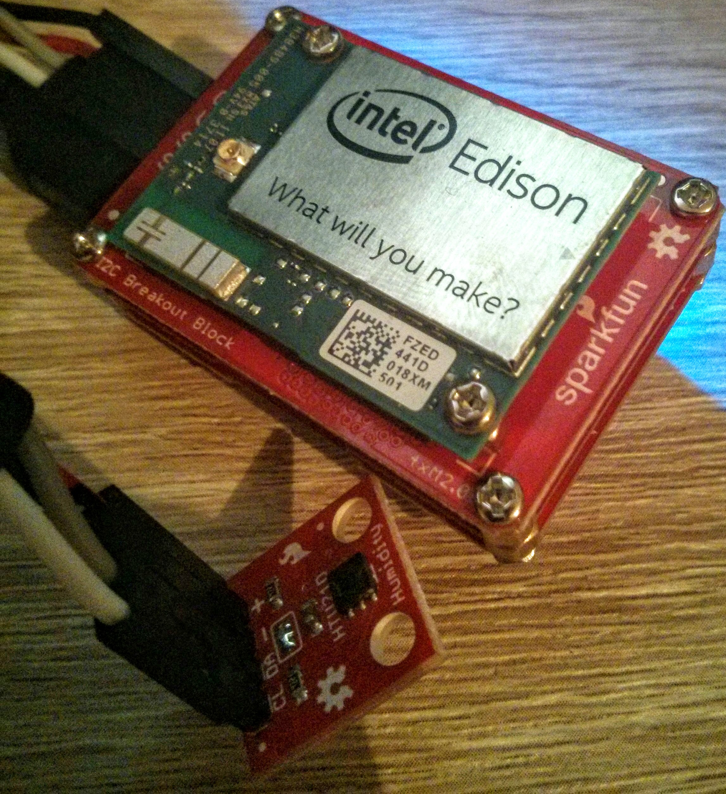

# Python logger for the HTU21D temperature/humidity sensor

This logs temperature/humidity from an HTU21D sensor. It was tested on an Intel Edison board with the I2C breakout:

* <https://www.sparkfun.com/products/13024>
* <https://www.sparkfun.com/products/13034>

To interact with the board, I also used the base block:

* <https://www.sparkfun.com/products/13045>

